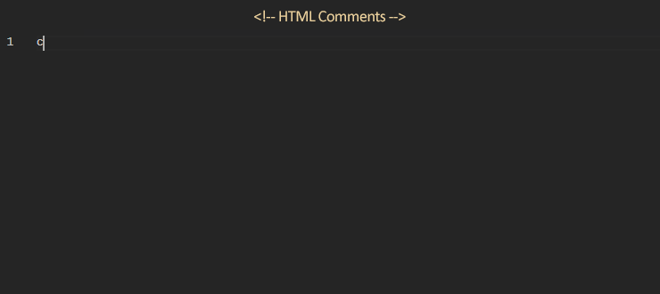

# Comments Toolkit

Comments Toolkit provides comments auto-completions (snippets) for various programming languages. It supports both single-line and multi-line comments and allows users to insert predefined comment patterns using completion items.

## Features

- Supports multiple programming languages with their respective comment styles.
- Provides predefined comment patterns such as sections, subsections, simple comments, blocks, and TODOs.
- Automatically adjusts the length of comment lines to maintain a consistent format.
- Registers completion item providers for active editors to offer comment pattern suggestions.
- Caches generated comment patterns to avoid redundant computations.
- Logs messages with different log levels (info, warning, error) for better debugging and monitoring.

## Usage

Start typing "*comm:*", and the auto-complete list will appear with available comment patterns.

## File types & Languages

The completions are currently available for the following languages and file types:

- HTML
- PHP
- JavaScript
- TypeScript
- CSS
- SCSS
- C#
- Vue.js
- ABAP
- Batch
- BibTeX
- Clojure
- CoffeeScript
- C
- C++
- CUDA C++
- Diff
- Dockerfile
- F#
- Git Commit
- Git Rebase
- Go
- Groovy
- Handlebars
- INI
- Java
- JavaScript React
- JSON
- JSON with Comments (JSONC)
- LaTeX
- Less
- Lua
- Makefile
- Markdown
- Objective-C
- Objective-C++
- Perl
- Perl 6
- Plain Text
- PowerShell
- Pug (Jade)
- Python
- R
- Razor
- Ruby
- Rust
- Sass
- ShaderLab
- Shell Script
- SQL
- Swift
- TypeScript React
- TeX
- Visual Basic
- XML
- XSL
- YAML

If you want to add other languages or file types, please [open an issue](https://github.com/migliori/vsc-comments-toolkit/issues).

## More

### --- Curious to discover high-quality tools for web developers? ---

- PHP CRUD Generator - Create outstanding [Bootstrap 4 Admin Panel](https://www.phpcrudgenerator.com)
- PHP Form Builder - The very best [PHP Form Generator](https://www.phpformbuilder.pro)
